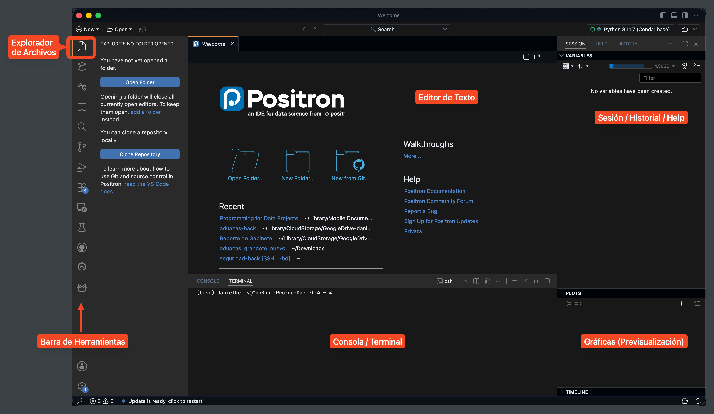
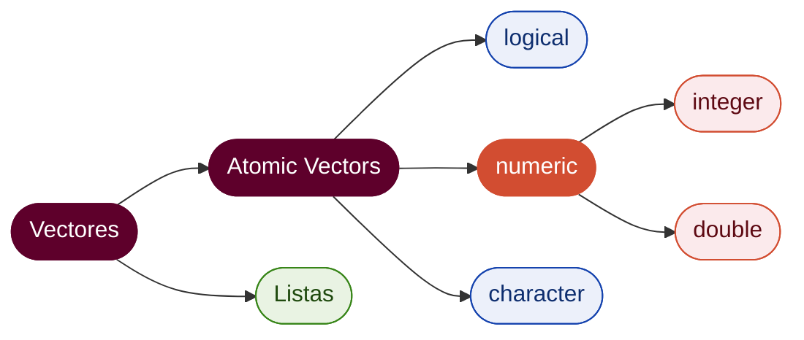

---
layout: section
eyebrow: Sesión 1 — Bloque de exposición
---

# Introducción al Curso

---
layout: default
section: Sesión 1
subsection: Introducción al Curso
---

# Programación para Proyectos de Datos
Curso comprensivo orientado a la construcción de **proyectos completos de datos**.  

- **Diagnóstico:** Gran parte del contenido disponible, dentro y fuera del programa, se concentra en *habilidades aisladas* y *herramientas específicas*, no en el flujo completo de un proyecto.

- **Objetivo:** Brindar a los estudiantes las herramientas programáticas y conceptuales necesarias para construir flujos de datos completos, reproducibles y automatizables: desde la extracción y limpieza hasta el análisis y el producto final.

- **Filosofía:** [zero-to-hero]{.colmex-blue} (no es necesario tener experiencia previa en programación).
- **Duración:** 6 semanas, con una sesión semanal de 3:00 h.
- **Secuencia:** este es el [primero de dos cursos]{.colmex-orange}; el segundo retoma donde este termina.
- **Lenguaje:** R como único lenguaje del curso (la decisión se justifica más adelante).
- **IDE:** [Positron]{.colmex-orange}, entorno de trabajo recomendado para el curso.


---
layout: default
section: Sesión 1
subsection: Estructura del Curso
---

# Estructura del Curso
Índice temático por sesión.

### Bloque 1: Fundamentos
- **Sesión 1:** El lenguaje y el proyecto: R, Positron, `git` y GitHub.
- **Sesión 2:** Estructuras de datos, importación y exploración.

### Bloque 2: Manipulación
- **Sesión 3:** `dplyr` 1; pipes, verbos y `tidyverse`.
- **Sesión 4:** `dplyr` 2; joins, pivots y manejo de texto con `stringr`.

### Bloque 3: Programación y Visualización
- **Sesión 5:** Control de flujo, vectorización y funciones.
- **Sesión 6:** Programación funcional y visualización con `ggplot2`.


---
layout: default
section: Sesión 1
subsection: Estructura del Curso
---

# ¿Y después?
Contenido del [segundo curso]{.colmex-orange} de la secuencia.

### Análisis
- Reproducibilidad avanzada y consumo de APIs (`httr2`).
- Modelado estadístico programático.
- Datos a escala: `SQL`, `DBI` y `dbplyr`.

### Productos Finales
- Visualización avanzada y el ecosistema de `ggplot2`.
- Automatización con `officer`, `googledrive` y `gmailr`.
- Aplicaciones interactivas con `Shiny`.
- Interfaces de modelos de lenguaje.

<br>

No es un curso de habilidades aisladas, sino de construcción de proyectos completos de datos. Tampoco se busca que el estudiante se vuelva experto, sino que domine las herramientas básicas para posteriormente profundizar en los temas tratados.


---
layout: default
section: Sesión 1
subsection: Motivación
---


# ¿Por qué este curso?
Motivación general ([programación]{.colmex-blue}) y específica ([este curso]{.colmex-blue}).

Los cursos previos del programa equipan al estudiante con [habilidades específicas]{.colmex-blue} de programación y de análisis estadístico.  

### ¿Por qué programar?
- Ofrece una forma de pensar y enfrentar problemas, con énfasis en la capacidad de articular soluciones reproducibles y auditables.  
- Salidas laborales amplias.
- Es una herramienta clave para economistas, pues cierra la brecha `teoría` $\to$ `práctica`.

### ¿Por qué este curso?
Énfasis en cómo las habilidades programáticas específicas [se articulan dentro de un mismo proyecto]{.colmex-orange}:  
- Estructurar un repositorio reproducible.
- Traer datos de fuentes diversas.
- Limpiarlos sistemáticamente.
- Modelarlos.
- Producir un entregable comunicable.

---
layout: default
section: Sesión 1
subsection: Evaluación
---

# Esquema de evaluación
Desglose de la evaluación para el curso.

| Componente                                     | Peso |
|------------------------------------------------|-----:|
| Ejercicios del bloque de práctica (6)          | 70%  |
| Asistencia y participación                     | 30%  |

[Sin tareas fuera de clase.]{.colmex-orange} Cada sesión de 3:00 h se divide en un [bloque de exposición]{.colmex-blue} (≈1:45) y un [bloque de práctica]{.colmex-orange} (≈1:15). Lo evaluable se resuelve en clase.

### Un solo conjunto de datos
- Las seis sesiones trabajan sobre la [ENSU]{.colmex-blue} (Encuesta Nacional de Seguridad Pública Urbana, INEGI).
- Cada práctica continúa la anterior: importar $\to$ transformar $\to$ automatizar $\to$ graficar.
- No hay proyecto con entregas parciales; eso corresponde al segundo curso.

---
layout: section
eyebrow: Sesión 1 — Bloque de exposición
---

# ¿Por qué R?

---
layout: default
section: Sesión 1
subsection: ¿Por qué R?
---

# R, Python, Stata: ¿cuándo cada uno?
Diferencias entre los lenguajes de programación más usados para manejo de datos y estadística.

[**R**]{.colmex-blue} — lenguaje de la investigación cuantitativa en economía.

- Ecosistema completo diseñado alrededor del trabajo con datos.
- Sintaxis vectorizada nativa; verbos de manipulación de datos expresivos que se encadenan entre sí.
- Excelente para insumos reproducibles: reportes, gráficas publicables y modelos estadísticos.

<br>  

[**Python**]{.colmex-orange} — propósito general; fuerza en producción y ML.

- Lenguaje de propósito general, adaptado al trabajo con datos (menos amigable).
- Ecosistema muy rico para modelos de aprendizaje automático e IA.
- Más "bajo nivel" que R.

<br>  

[**Stata**]{.colmex-orange} — históricamente común en economía aplicada.

- Requiere una licencia costosa.
- Es menos flexible para estructurar flujos reproducibles de punta a punta.
- Tiene un alcance más acotado como lenguaje de programación general.
- Su manejo interactivo de objetos es más limitado que en un IDE moderno para R.
- [Descartado de origen para este curso.]{.colmex-orange}

---
layout: default
section: Sesión 1
subsection: Ecosistema de R
---

# Tres piezas que vamos a usar todo el curso
Bloques fundacionales del trabajo con [R]{.colmex-blue}.

[**CRAN**]{.colmex-blue} — Comprehensive R Archive Network.

- Repositorio oficial de paquetes y distribuciones del lenguaje. Garantiza compatibilidad con la versión que estés corriendo y verifica los paquetes antes de publicarlos.
- Sistematización de la naturaleza `open-source` del lenguaje.  

<br>

[**tidyverse**]{.colmex-blue} — colección de paquetes con [gramática compartida]{.colmex-orange}.

Manipulación (`dplyr`), visualización (`ggplot2`), strings (`stringr`), iteración (`purrr`), entre otros. Es el dialecto principal del curso y del uso de [R]{.colmex-blue}.

<br>

[**Positron**]{.colmex-blue} — IDE (*Integrated Development Environment*) pensado específicamente para análisis de datos (desarrollado por Posit).

- Provee infraestructura comercial sin comprometer la naturaleza abierta del lenguaje.
- Instrucciones de instalación a continuación.

---
layout: section
eyebrow: Sesión 1 — Bloque de exposición
---

# Setup: Positron + R

---
layout: default
section: Sesión 1
subsection: Instalación
---

# Instalación + Setup Inicial
Las dos piezas que requerimos para empezar.

[**1. R**]{.colmex-blue} — el intérprete del lenguaje.

Descarga desde [CRAN](https://cran.itam.mx/).

[**2. Positron**]{.colmex-orange} — el IDE.

Descarga desde [positron.posit.co](https://positron.posit.co/). Es un entorno moderno de trabajo para datos, desarrollado por Posit.

<br>

<Azul t="Instrucciones de Instalación">

1. Descarga [R]{.colmex-blue} desde [CRAN](https://cran.itam.mx/) y [Positron]{.colmex-orange} desde la web de [Posit](https://positron.posit.co/).
2. Verifica la instalación abriendo `Terminal` (Mac) o `Shell` (Windows) y ejecutando:
```bash
R --version
```
3. Dirígete a la consola de [Positron]{.colmex-orange} y ejecuta:
```r
print("Mi primera línea de código")
```

</Azul>

---
layout: default
section: Sesión 1
subsection: El IDE
---

# Anatomía de Positron

- [**Editor de Texto**]{.colmex-blue} — los scripts `.R` que editas.
- [**Consola**]{.colmex-blue} — donde se ejecuta R en vivo.
- [**Sesión**]{.colmex-orange} — los objetos creados en la sesión actual (environment).
- [**Gráficas**]{.colmex-orange} — previsualización de outputs visuales.
- [**Explorador de Archivos**]{.colmex-orange} — navegación en los archivos del proyecto.

<br>

<div style="display: flex; justify-content: center;">
  
</div>
---
layout: default
section: Sesión 1
subsection: Flujo de Trabajo
---

# Flujo mínimo dentro del IDE
Secuencia básica de trabajo en una sesión normal.

1. Abrir o una carpeta de trabajo `Open Folder` o `Open File`.
2. Crear un script `.R` en [Source]{.colmex-blue}.
3. Escribir una instrucción pequeña y correrla con `Cmd/Ctrl-Enter`.
4. Revisar el resultado en [Consola]{.colmex-blue}.
5. Inspeccionar los objetos creados en [Environment]{.colmex-orange}.
6. Guardar el script antes de cerrar la sesión.
7. **¡Evita las rutas absolutas en el código!**

<br>

<Rojo t="! Prácticas a Evitar">

Se recomienda evitar trabajar escribiendo todo directamente en la consola. La consola sirve para [probar]{.colmex-blue}; el script sirve para construir flujos que se puedan [conservar]{.colmex-orange} y [reproducir]{.colmex-blue}.

</Rojo>


---
layout: default
section: Sesión 1
subsection: Paquetes
---

# Paquetes
R base trae lo esencial; casi todo lo demás vive en [paquetes]{.colmex-blue}.

Un paquete es una colección de funciones que alguien más escribió y publicó. Se [instalan una vez]{.colmex-orange} y se [cargan en cada sesión]{.colmex-blue}:

```r
install.packages("dplyr")   # una sola vez, descarga desde CRAN
library(dplyr)              # en cada sesión, para tenerlo disponible
```

<br>

[CRAN]{.colmex-blue} es el repositorio oficial: más de 20,000 paquetes revisados. Es de donde baja `install.packages()`.

<br>

<Rojo t="! Prácticas a Evitar">

Dejar `install.packages()` dentro del script. Se ejecuta cada vez que alguien lo corre, descarga de nuevo y tarda una eternidad. La instalación se hace en la consola; el script solo carga.

</Rojo>

---
layout: default
section: Sesión 1
subsection: Paquetes
---

# `pacman`
Un solo comando en vez de dos, para cualquier número de paquetes.

El problema del flujo anterior: si alguien más abre tu script sin tener los paquetes instalados, falla. `pacman` [instala lo que falte y carga todo]{.colmex-blue} en una sola línea.

```r
install.packages("pacman")   # una sola vez en la vida

pacman::p_load(dplyr, ggplot2, readr)
```

<br>

La convención del curso es que todo script empiece así:

```r
if (!requireNamespace("pacman", quietly = TRUE)) install.packages("pacman")
pacman::p_load(tidyverse)
```

<br>

<Verde t="Sobre el operador ::">

`paquete::funcion()` usa una función [sin cargar el paquete completo]{.colmex-blue}, y deja explícito de dónde viene.

</Verde>

---
layout: section
eyebrow: Sesión 1 — Bloque de exposición
---

# Modelos de lenguaje en el curso

---
layout: default
section: Sesión 1
subsection: Modelos de Lenguaje
---

# Chatbot vs. Agente Integrado
Paradigmas de uso de las herramientas de Inteligencia Artificial.

Los modelos de lenguaje son herramientas extremadamente útiles que están revolucionando el campo de la programación, pero **el 99% de los usuarios explota el 10% de su potencial y carga con el 100% de los perjuicios**. Se pueden incorporar al flujo de trabajo, pero su capacidad se aprovecha mejor al darles contexto amplio y utilizarlos para tareas específicas que no dependen de tu capacidad de copiar/pegar código.

[**LLM como chatbot**]{.colmex-orange} — pegas la pregunta, copias la respuesta.

- ChatGPT, Claude, Gemini en su interfaz web.
- Cero contexto del proyecto; depende de lo que tú copies.
- [Riesgo:]{.colmex-orange} atrofia la capacidad individual de razonar sobre código.

[**LLM como agente integrado**]{.colmex-blue} — lee archivos, propone cambios, ejecuta comandos con el humano en el [proceso]{.colmex-blue}.

- [Claude Code de Anthropic]{.colmex-blue}, [Codex de OpenAI]{.colmex-blue}.
- Conoce tu repositorio, tus convenciones, tus errores recientes.
- Puede acelerar drásticamente el trabajo, pero solo si ya dominas los fundamentos.

---
layout: default
section: Sesión 1
subsection: Política del Curso
---

# Política del curso
¿Cómo usar los LLM's como herramienta en el flujo?

[**Permitido**]{.colmex-blue} en tu trabajo propio fuera de clase, [como agente]{.colmex-blue}. Documenta qué le pediste y verifica cada línea que entregues.

[**No permitido**]{.colmex-orange} en el bloque de práctica de cada sesión. Ese es el momento para que [tú]{.colmex-orange} construyas el músculo.

[**Regla práctica**]{.colmex-blue}: debes ser capaz de leer y modificar cualquier línea que entregues como tuya.

<br>

<Rojo t="Advertencia">

La idea no es prohibir herramientas reales. La idea es que termines el curso pudiendo programar [sin depender de ellas]{.colmex-orange}, pero aprovechando estas herramientas para incrementar tu flujo de trabajo.

</Rojo>

---
layout: section
eyebrow: Sesión 1 — Bloque de exposición
---

# El lenguaje R

---
layout: default
section: Sesión 1
subsection: El Lenguaje R
---

# Tres características clave
Características técnicas del lenguaje.

[R]{.colmex-blue} tiene 3 características clave que lo vuelven un lenguaje especialmente bueno para tratamiento de datos:

1. [**Interpretado**]{.colmex-blue} — cada línea se ejecuta de manera independiente sin un paso de compilación previo. Esto permite:
  - Probar código muy rápidamente.
  - Explorar datos paso a paso.
  - "Modulizar" el código de forma muy sencilla.

<br>

2. [**Vectorizado**]{.colmex-blue} — la mayoría de las operaciones base del lenguaje operan sobre *todo un vector* no un elemento a la vez. Esto permite:
  - Aprovecha estas operaciones para construir funciones vectorizadas.
  - Acorta el código y lo acerca a la notación matemática.
  - Reduce la necesidad de `for-loops` innecesarios.

<br>

3. [**Multiparadigma**]{.colmex-blue} — (aspectos más técnicos) admite estilos funcional, imperativo y orientado a objetos, sin imponer uno. Permite entonces:
  - **Funcional:** Construir/utilizar funciones para simplificar operaciones.
  - **Imperativo:** Permite realizar operaciones paso a paso en código "sencillo".
  - **Orientado a Objetos:** Cada objeto tiene una clase, lo que permite construir comportamientos específicos de acuerdo al tipo de objeto.

<br>

### En pocas palabras: [R]{.colmex-blue} es una máquina!

---
layout: default
section: Sesión 1
subsection: Ejecución de Código
---

# Tres formas de ejecutar código
¿Cómo transformar nuestro código en instrucciones para la computadora?

<br>

[**1. REPL**]{.colmex-blue} (Read-Eval-Print Loop) — la consola interactiva. Útil para exploración rápida.

<br>

[**2. Script con `source()`**]{.colmex-blue} — ejecuta un archivo `.R` completo desde la consola.

```r
source("pre/01-extract.R")
```

<br>

[**3. Ejecutable con `Rscript`**]{.colmex-blue} — corre un script desde la terminal del sistema, sin abrir R interactivo.

```bash
Rscript pre/01-extract.R
```
<br>

[Convención del curso:]{.colmex-orange} durante autoría usamos REPL para inspeccionar, pero el ETL final se diseña para correrse con `Rscript` o `source()` desde un master script.  


---
layout: default
section: Sesión 1
subsection: Ejecución de Código
---

# ¿Cómo utilizar el editor?
Convenciones y atajos que serán útiles más adelante.

<Azul t="Instrucciones para ejecutar nuestro código">

1. Crear un directorio para el curso, con una carpeta dentro que llamaremos `sesion_01`.   
2. Descargar el código `script_de_prueba.R` adjunto al correo electrónico, y coloquemoslo dentro.  
3. Abramos [Positron]{.colmex-orange} y hagamos `Open` $\to$ `Open Folder` y búsquemos el directorio del proyecto.  
4. En el `Explorador de Archivos` abrimos la carpeta `sesion_01` y presionamos `Open`.  

</Azul>

### Atajos de Teclado
- `cmd/ctrl + Enter` $\to$ Ejecutar la línea de código sobre la que estemos colocados.
- `cmd/ctrl + Shift + Enter` $\to$ Ejecutar todo el script.
- `cmd/ctrl + Shift + B` $\to$ Insertar un pipe (|>).
- `optn + cmd + B` / `alt + ctrl + B` $\to$ Correr desde el inicio del script hasta la línea actual.
- `optn + cmd + E` / `alt + ctrl + E` $\to$ Correr desde la línea actual hasta el final del script.
- `cmd/ctrl + Shift + C` $\to$ Comentar una línea.

<br>

Mayor detalle se puede encontrar en [R-Studio Keybindings on Positron](https://positron.posit.co/migrate-rstudio-keybindings.html) o [Keyboard Shortcuts](https://positron.posit.co/keyboard-shortcuts.html).  

[Experimenten!]{.colmex-orange}


---
layout: section
eyebrow: Sesión 1 — Bloque de exposición
---

# Objetos en R

---
layout: default
section: Sesión 1
subsection: Objetos en R
---

# Objetos en R
¿Cómo funcionan los objetos y las asignaciones en [R]{.colmex-blue}?

[R]{.colmex-blue} es un *Lenguaje de Programación Orientado a Objetos*:
- Todo el flujo de trabajo gira en torno al uso de `objetos` y `asignaciones de nombres`.
- Un `objeto` es cualquier cosa que exista dentro de [R]{.colmex-blue}.
- Al crear una asignación entre un `objeto` y un `nombre`, lo podemos utilizar después para manipularlo.  

<br>

```r
a = "prueba"    # Creamos el objeto "prueba" asociado al nombre `a`.
```

Aunque aludamos al `objeto` por su `nombre`, en realidad nos referimos a su **contenido**.

<br>

<Verde t="Tras bambalinas...">

Al ejecutar el código de antes, [R]{.colmex-blue} hace dos cosas:  
1. Crea un objeto (`"prueba"`) sin nombre, pero con una dirección asignada en memoria (podemos verificar esta dirección con `lobstr::obj_addr()`).
2. Crea un `binding` entre el objeto y el nombre `a`.

</Verde>

---
layout: default
section: Sesión 1
subsection: Objetos en R
---

# Bindings
¿Cómo vincular un objeto a un nombre?

Para experimentar con los `bindings`, creemos un nuevo objeto `b` que sea **igual** a `a`:

```r
b = a         # Nuevo objeto, replicando el valor de `a`.   
```

Y ahora inspeccionamos su dirección usando la función `lobstr::obj_addr()`:

```r
obj_addr(a)
[1] "0xadbdd1888"
obj_addr(b)
[1] "0xadbdd1888"
```

Noten como ambos `bindings` tienen la misma dirección, porque de fondo **son el mismo objeto**, asociado a dos `nombres` distintos.

<br>

> Los operadores `<-` y `=` son equivalentes para asignar nombres a objetos. **Yo** prefiero el uso de `=` porque homologa la notación con la que se usa en funciones y otros operadores numéricos. Sujeto a preferencia personal siempre y cuando [se use consistentemente]{.colmex-orange}.


---
layout: default
section: Sesión 1
subsection: Funciones
---

# Funciones
Bloques de código que reciben objetos y regresan valores.

Llamamos a las funciones usando su nombre, seguido de `()`. Los objetos que toman como input ([argumentos]{.colmex-blue}) van dentro de estos paréntesis:
```r
# Llamamos a la función por su nombre, toma argumentos y retorna un valor:
valor_de_retorno = nombre_de_la_funcion(argumentos)
```

### ¿De dónde vienen?

- [**Base R**]{.colmex-blue} — disponibles sin cargar nada: `mean()`, `sum()`, `c()`, `length()`, `str()`.
- [**Paquetes**]{.colmex-orange} — requieren instalación y carga previa. `read_csv()` pertenece a `readr`; `filter()`, a `dplyr`.

Usaremos la sintaxis `paquete::nombre_de_la_funcion()` para indicar que una función proviene de un paquete específico.

### Argumentos
```r
rnorm(
  10             # Por posición, sin nombre
  mean = 0,       # Por nombre, en cualquier órden
  sd = 1
)
```

<br>

> Podemos acceder a la documentación de una función usando: `?nombre_de_la_funcion()`


---
layout: default
section: Sesión 1
subsection: Vectores
---

# Listas y Vectores
Los objetos clave de [R]{.colmex-blue}.

[R]{.colmex-blue} está construido alrededor de [vectores]{.colmex-blue} que subsecuentemente se dividen en dos tipos: `atomic-vectors` y `listas`. La diferencia es **el tipo** de objetos que pueden alojar.

- **Atomic Vectors:** Estructuras de datos donde se pueden almacenar objetos con **los mismos tipos**. (Concepto clave: `coerción`).
```r
vector = c("A", "B", "C")
```
- **Listas:** Estructuras de datos que pueden almacenar objetos de **diversos** tipos.
```r
lista = list(
    "A",
    c("elemento—1", "elemento-2", "elemento-3"),
    TRUE
)
```

<div style="display:flex; justify-content:center; margin-top:0.5rem; transform:scale(1.5); transform-origin:top center; margin-bottom:5rem;">



</div>


---
layout: default
section: Sesión 1
subsection: Vectores
---

# Vectores Atómicos
¿Qué tipos de Vectores Atómicos existen?

> **NOTA:** Los escalares (valores individuales) son también vectores, pero de longitud 1. Están sujetos a la misma lógica. Los siguientes ejemplos los veremos con escalares, y luego como construir vectores de mayor longitud.

Existen 4 tipos de `atomic-vectors` en R:
```r
l = TRUE            # logical (TRUE o FALSE)
i = 10L             # interger (número entero + sufijo `L`)
d = 12.125          # double (valor numerico con decimales)
c = "Texto"         # character (`strings` de texto)
```

<br>

Todos los vectores tienen 3 propiedades: `tipo`, `longitud` y `atributos`:
1. **Tipo:** Lo que veíamos ahora (logical, interger, ...). Se accede con `typeof()`.
2. **Longitud:** Número de elementos que tiene el vector. Se accede con `lenght()`.
3. **Atributos:** Metadata genérica del vector. Se accede con `attributes()`. El más importante es la [clase]{.colmex-blue}, que faculta comportamiento distinto para distintos inputs.

---
layout: default
section: Sesión 1
subsection: Vectores
---

# Propiedades de los Vectores
Tipo, longitud y clase.

**Tipo:** Exploración con `typeof()`.
```r
typeof("A")
[1] "character"
```

**Longitud:** Exploración con `length()`.
```r
a = 1:10
length(a)
[1] 10
```

**Atributos:** Exploración de todos con `attributes()` o de uno en particular con `attr(x, "nombre_del_atributo")`.
```r
x = c(rnorm(10, mean = 0, sd = 1))
attributes(x) # Los vectores atómicos, por defecto, no poseen atributos

attr(x, "autor") = "Daniel Kelly" # Pero podemos generarlos
attributes(x)
$autor
[1] "Daniel Kelly"
```

---
layout: default
section: Sesión 1
subsection: Vectores
---


# Coerción y Concatenación
Vectores con múltiples elementos y tipos distintos.

### Concatenación

Usando la función `c(...)` podemos unir varios elementos en un solo vector.
```r
y = c("A", "B", "C").     # c() quiere decir `concatenate`.
```

### Coerción

Antes dijimos que todos los elementos de un vector atómico deben tener el mismo tipo. Entonces, ¿por qué la ejecución de `c("A", 1)` no arroja un error?

```r
c("A", 1)
[1] "A" "1"
```

¿Qué pasó aquí? R coercionó el tipo de `1` a caracter, para poder unir los dos elementos. La coerción se da en un órden específico:

```r
logical -> interger -> double -> character
as.TIPO(x)   # Coercionar el vector x a `TIPO`
```

---
layout: default
section: Sesión 1
subsection: Operadores
---

# Operadores y Funciones Matemáticas

Por defecto, [R]{.colmex-blue} incluye **funciones** y **operadores aritméticos** que permiten ejecutar operaciones matemáticas.

### Operadores Aritméticos

```r
1 + 1             # suma
10 - 2            # resta
5 * 3             # multiplicación
12 / 4            # división
16 %% 5           # modulo (restante de la división)
```

### Funciones

```r
x = 1:5
mean(x)          # promedio (weighted_mean(x, w) calcula el promedio ponderado)
sd(x)            # desviación estándar
sum(x)           # suma de todos los elementos de `x`
min(x) / max(x)  # mínimo/máximo del vector `x`
```

Existen también otras muchas funciones: `log()`, `abs()`, `sin()`, `cos()`, `median()`, `var()`, `range()`, etc.

> ¿Qué se obtiene al ejecutar `sum()` y `mean()` sobre `c(TRUE, FALSE, FALSE, TRUE, TRUE)`?

---
layout: default
section: Sesión 1
subsection: Condiciones Lógicas
---

# Evaluación de Condiciones Lógicas (1)
¿Cómo verificar que un statement es cierto?

Utilizando el operador `==` (doble signo de igual) es como si le preguntáramos a [R]{.colmex-blue} si el **lado derecho** de la expresión es igual al **lado izquierdo**. A cambio, recibimos un `TRUE` o `FALSE` dependiendo del resultado.

```r
"prueba" == "prueba"
[1] TRUE

5 >= 6
[1] FALSE
```

<br>

Podemos encadenar condiciones lógicas usando `&` (AND) o `|` (OR):

```r
("prueba" == "prueba") & (5 == 6)
[1] FALSE

("prueba" == "prueba") | (5 == 6)
[1] TRUE
```

<br>

Además de esto, existen operadores para mayor/menor (`<`, `>`, `<=`, `>=`) y no igualdad (`!=`).

---
layout: default
section: Sesión 1
subsection: Vectorización
---


# Vectorización
Detalle del sistema de operaciones vectorizadas de [R]{.colmex-blue} (clave para el resto del curso).

Todas las operaciones que hemos visto hasta ahora sirven para transformar **un input** en **un output**. Pero, ¿qué pasa si hacemos la siguiente operación?
```r
a = c(10, 20, 20, 40) 
a + 10        # Sumamos 10 a un vector???
```
<br>

Este es un ejemplo de una operación `vectorizada`, es decir, que puede realizarse **elemento a elemento** sobre un vector:
```r
a + 10 
[1] 20 30 30 50
```

<br>

> Noten como la vectorización elimina la necesidad de **iterar** sobre cada elemento de un vector, y nos permite directamente realizar operaciones con ellos.

<br>

No siempre se puede usar una operación vectorizada, pero verán lo importantes que son cuándo empecemos a trabajar con tablas.


---
layout: default
section: Sesión 1
subsection: Condiciones Lógicas
---

# Evaluación de Condiciones Lógicas (2)
¿Cómo verificar que un statement es cierto?

Antes mencionamos los operadores lógicos y de comparación, pero de fondo, todos ellos están **vectorizados**:

```r
a = c(10, 20, 30, 40) 
a > 15
[1] FALSE  TRUE  TRUE  TRUE         # Nos regresa un vector lógico de la misma longitud.
```

<br>

Podemos sobreescribir este comportamiento predeterminado usando las funciones `any()` y `all()`:
```r
# any() -> Alguno de los elementos cumple la condición lógica:
any(a > 15)
[1] TRUE

# all() -> Todos los elementos cumplen la condición lógica:
all(a > 15)
[1] FALSE
```

<br>

> Todas las condiciones lógicas se pueden negar usando `!` antes de la expresión.


---
layout: section
eyebrow: Sesión 1 — Bloque de exposición
---

# El proyecto

---
layout: default
section: Sesión 1
subsection: Estructura del Proyecto
---

# De un script suelto a un proyecto
Todo lo anterior se escribió en un archivo aislado. De aquí en adelante, el trabajo vive en una [estructura fija]{.colmex-blue}.

```bash
curso-ppd/
├── curso-ppd.Rproj    # el archivo de proyecto
├── files/             # datos crudos, tal como se descargan
├── docs/              # descriptores técnicos, catálogos, documentación
├── pre/               # los scripts. Aquí se trabaja
└── output/            # todo lo que produce el código
```

<br>

El criterio de la separación no es estético, sino de [ciclo de vida]{.colmex-orange}:

- `files/` es [insumo]{.colmex-blue} y se trata como de solo lectura. No es nuestro y no se modifica.
- `output/` es [desechable]{.colmex-orange}. Se debe poder borrar completo, porque el código lo regenera.

<br>

<Verde t="Criterio">

Si borrar `output/` rompe el proyecto, entonces el proyecto [no es reproducible]{.colmex-orange}.

</Verde>

---
layout: default
section: Sesión 1
subsection: Estructura del Proyecto
---

# Rutas relativas
Por qué importa abrir el `.Rproj` antes de trabajar.

Con el proyecto abierto, el [directorio de trabajo]{.colmex-blue} queda fijo en la raíz del proyecto:

```r
getwd()
[1] "/Users/daniel/curso-ppd"
```

<br>

Y entonces las rutas se escriben [relativas]{.colmex-blue} a esa raíz:

```r
read_csv("files/ensu_2024_t1.csv")           # funciona en cualquier computadora
read_csv("/Users/daniel/Desktop/ensu.csv")   # funciona solo en la mía
```

<br>

<Rojo t="! Prácticas a Evitar">

`setwd("/Users/daniel/...")` al inicio del script. Es la razón número uno por la que el código de alguien más no corre en tu máquina.

</Rojo>

---
layout: section
eyebrow: Sesión 1 — Bloque de exposición
---

# Git y GitHub

---
layout: default
section: Sesión 1
subsection: Git
---

# ¿Qué problema resuelve?
La alternativa a `tesis_final_v2_BUENA_esta_si.R`.

[**Git**]{.colmex-blue} lleva el historial del proyecto: qué cambió, cuándo y por qué. [**GitHub**]{.colmex-orange} es el lugar donde ese historial vive en línea y se puede compartir.

<br>

- Puedes volver a cualquier estado anterior del proyecto.
- Puedes ver exactamente qué línea cambió entre dos versiones.
- Puedes trabajar desde varias computadoras sin perder el hilo.

<br>

<Azul t="Nota">

Los comandos que siguen [no son de R]{.colmex-orange}. Van en la **Terminal** de Positron, no en la consola de R.

</Azul>

---
layout: default
section: Sesión 1
subsection: Git
---

# El ciclo de trabajo
Tres comandos, siempre en el mismo orden.

Una sola vez por computadora:
```bash
git config --global user.name  "Nombre Apellido"
git config --global user.email "correo@colmex.mx"
```

<br>

Una sola vez por proyecto:
```bash
git init
```

<br>

Y de ahí en adelante, el ciclo:
```bash
git status                                 # ¿qué cambió?
git add pre/sesion_01.R                    # ¿qué entra en la foto?
git commit -m "Agrega ejercicios lógicos"  # toma la foto
git log --oneline                          # ver el historial
```

---
layout: default
section: Sesión 1
subsection: GitHub
---

# Sincronizar con GitHub
Del repositorio local al remoto.

Tras crear el repositorio [vacío]{.colmex-blue} en GitHub, se conecta una sola vez:

```bash
git remote add origin https://github.com/usuario/repositorio.git
git push -u origin main
```

<br>

Y en adelante, solo dos comandos:

```bash
git push    # subir los commits locales
git pull    # traer los que no tengo
```

<br>

<Verde t="Sobre los mensajes de commit">

Un commit corresponde a [un cambio con sentido propio]{.colmex-blue}, no a "lo que llevaba hoy". El mensaje explica el porqué, no el qué: el qué ya está en el diff.

</Verde>

---
layout: default
section: Sesión 1
subsection: GitHub
---

# Qué NO se versiona
El archivo `.gitignore` lista lo que Git debe ignorar.

```bash
files/          # datos crudos: pesados y no son nuestros
output/         # se regenera con el código
.Rhistory       # historial de la consola
.RData          # imagen del entorno
.Rproj.user/    # configuración local del IDE
.DS_Store       # basura de macOS
.env            # credenciales, tokens, contraseñas
```

<br>

<Rojo t="Advertencia">

Un token subido a un repositorio público [queda en el historial]{.colmex-orange} aunque lo borres después: el commit que lo introdujo sigue ahí. La forma de no tener ese problema es [no cometerlo]{.colmex-blue}.

</Rojo>

---
layout: cover
title: ¡Gracias!
subtitle: Sesión 1 — Programación para Proyectos de Datos I
---
