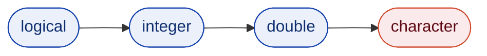

---
layout: default
section: Sesión 2
subsection: Mapa de la Sesión
---
# ¿Dónde estamos?
La Sesión 1 dejó el lenguaje instalado y el proyecto estructurado. Faltan los [datos]{.colmex-blue}.

Hasta ahora todos los objetos se escribieron a mano dentro del script. Ningún proyecto real funciona así: los datos llegan como [archivos]{.colmex-orange} que alguien más produjo, con el formato que esa persona decidió.

### Contenido de la sesión

1. [**Estructuras de datos**]{.colmex-blue} — listas, `data.frame` y `tibble`, y el *pipe* como forma de encadenar.
2. [**Importación**]{.colmex-orange} — traer un archivo al entorno y verificar que llegó completo.
3. [**Datos *tidy***]{.colmex-blue} — qué forma debe tener una tabla y cuál es su unidad de observación.
4. [**Indexación**]{.colmex-blue} — cómo se extrae una pieza de la tabla ya cargada.
5. [**Coerción y valores faltantes**]{.colmex-blue} — qué hace R cuando los tipos no coinciden y cuando el dato no existe.
6. [**Exploración**]{.colmex-orange} — descriptivas y gráficas con funciones base.

<br>

<Azul t="Restricción deliberada">

Esta sesión se limita a [R base]{.colmex-blue} y a los paquetes de importación. El `tidyverse` entra en la Sesión 3 y `ggplot2` en la Sesión 6: primero conviene reconocer qué ofrece el lenguaje por sí mismo.

</Azul>
---
layout: default
section: Sesión 2
subsection: Los Datos
---
# Los datos del curso
Un solo levantamiento, de la Sesión 2 en adelante.

La [EIGH]{.colmex-blue} es una encuesta [simulada]{.colmex-orange} de ingreso y gasto de los hogares: tres tablas relacionadas por el folio de la vivienda, más sus catálogos y su descriptor técnico. No corresponde a ninguna encuesta real; se generó para que el curso trabaje siempre sobre los mismos datos sin depender de una descarga.

| Archivo | Contenido | Formato |
|---|---|---|
| `files/eigh_hogares.csv` | 800 hogares: ingreso, gasto, entidad, integrantes | CSV, comas |
| `files/eigh_personas.txt` | 2,606 personas: sexo, edad, escolaridad, ingreso | texto, barra vertical |
| `files/eigh_gastos.csv` | 4,418 renglones de gasto por rubro | CSV, punto y coma |
| `files/eigh_catalogos.xlsx` | claves de entidad y de rubro de gasto | hoja de cálculo |
| `docs/eigh_descriptor.csv` | tipo, descripción y códigos de cada variable | CSV |

Los tres formatos de la sesión están ahí, y también los defectos de un archivo real: identificadores con ceros a la izquierda, códigos de no respuesta, una columna numérica capturada como texto y una copia en Latin-1.
---
layout: section
eyebrow: Sesión 2 — Bloque de exposición
---
# Estructuras de datos

---
layout: default
section: Sesión 2
subsection: Nombres
---
# Nombres válidos
Cómo se puede llamar a un objeto, y cómo conviene llamarlo.

Un nombre [sintáctico]{.colmex-blue} empieza con una letra, contiene solo letras, números, punto y guion bajo, y no coincide con una palabra reservada del lenguaje (`if`, `for`, `function`, `TRUE`, `NULL`, `NA`).

```r
edad_2024 = 1     # válido
Edad_2024 = 1     # válido, y distinto del anterior: R distingue mayúsculas
2024_edad = 1     # error: empieza con número
edad 2024 = 1     # error: contiene un espacio
```

Las columnas de una tabla importada no siempre cumplen esas reglas, porque el encabezado del archivo lo escribió alguien más. R las admite entre acentos graves:

```r
catalogo = list(`Entidad federativa` = "Oaxaca")
catalogo$`Entidad federativa`
[1] "Oaxaca"
```

<Verde t="Convención del curso">

Minúsculas, sin acentos y con guion bajo entre palabras: `fac_sel`, `edad_anios`. Los acentos son legales en R, pero viajan mal entre sistemas con codificaciones distintas: el mismo problema que aparece al importar.

</Verde>

---
layout: default
section: Sesión 2
subsection: Estructuras de Datos
---
# Del vector a la tabla
Un vector atómico no alcanza para representar un conjunto de datos.

La Sesión 1 cerró con vectores atómicos: colecciones de elementos [del mismo tipo]{.colmex-orange}. Un registro de encuesta no cabe ahí, porque mezcla un folio de vivienda (texto), un número de integrantes (entero) y un ingreso (decimal).

```r
c("0100012", 3, 48200)   # los tres elementos terminan siendo texto
```

<br>

R resuelve el problema con dos contenedores construidos sobre vectores:

- [**Lista**]{.colmex-blue} — elementos de cualquier tipo y de [cualquier longitud]{.colmex-orange}.
- [**DataFrame**]{.colmex-blue} — una lista de vectores, todos [de la misma longitud]{.colmex-orange}, dispuestos como columnas.

<br>

<Verde t="La idea central">

Un `data.frame` no es un tipo nuevo del lenguaje: es una [lista con una restricción y una clase]{.colmex-blue}. Todo lo que aplica a las listas aplica también a las tablas.

</Verde>
---
layout: default
section: Sesión 2
subsection: Listas
---
# Listas
Contenedores heterogéneos.

```r
resultado = list(
    modelo    = "Regresión lineal",
    n         = 800L,
    coefs     = c(intercepto = 2.4, ing_cor = -0.13),
    convergio = TRUE
)
```

<br>

Cada elemento conserva su [tipo]{.colmex-blue} y su [longitud]{.colmex-blue} originales. Consultar el tipo de la lista devuelve `"list"`; consultar el de un elemento devuelve lo que ese elemento sea:

```r
typeof(resultado)
[1] "list"

length(resultado)
[1] 4
```

El uso típico es agrupar salidas heterogéneas de un mismo análisis: la especificación, el tamaño de muestra, los coeficientes y el diagnóstico viven en un solo objeto y viajan juntos.

---
layout: default
section: Sesión 2
subsection: Listas
---
# Acceso a los elementos de una lista
Tres operadores con tres resultados distintos.

```r
resultado["coefs"]     # devuelve una LISTA de un elemento
resultado[["coefs"]]   # devuelve EL VECTOR que está adentro
resultado$coefs        # equivalente a [[ ]], por nombre
```

<br>

La diferencia es visible al inspeccionar la clase de cada resultado:

```r
class(resultado["coefs"])
[1] "list"

class(resultado[["coefs"]])
[1] "numeric"
```

<br>

<Rojo t="! Prácticas a Evitar">

Usar `[` cuando lo que se necesita es el contenido. Una lista de un elemento no se puede sumar, ni promediar, ni pasar a una función que espera un vector, y el error que se obtiene rara vez menciona al operador.

</Rojo>

---
layout: default
section: Sesión 2
subsection: DataFrames y Tibbles
---
# DataFrames
La estructura sobre la que trabaja el resto del curso.

Los datos del curso son la [EIGH]{.colmex-blue}, un levantamiento simulado de ingreso y gasto de los hogares. Su tabla de hogares, reducida a seis filas:

```r
hogares = data.frame(
    folioviv  = c("0100012", "0100027", "0100034", "0100041", "0100056", "0100063"),
    entidad   = c("09", "16", "09", "22", "16", "31"),
    tam_loc   = c(1, 3, 1, 2, 9, 4),      # 1 a 4; 9 = no especificado
    tot_integ = c(3, 5, 1, 4, 2, 6),
    ing_cor   = c(48200, 31500, 22800, 76400, 19900, 54100),
    gasto_mon = c(41300, 33800, 18500, 59200, 24600, 47700)
)
```

Cada columna es un vector y todas tienen la misma longitud. Las funciones de inspección devuelven exactamente eso:

```r
nrow(hogares)     # número de filas (observaciones)
ncol(hogares)     # número de columnas (variables)
dim(hogares)      # ambos: filas, columnas
names(hogares)    # nombres de las columnas
head(hogares)     # las primeras 6 filas
```

> `nrow()` es la primera verificación después de cargar cualquier archivo: si el número no coincide con lo documentado, algo se perdió en el camino.
---
layout: default
section: Sesión 2
subsection: DataFrames y Tibbles
---
# Tibbles
El `data.frame` del `tidyverse`, con el comportamiento corregido.

```r
pacman::p_load(tibble)

hogares = tibble(
    folioviv  = c("0100012", "0100027", "0100034", "0100041", "0100056", "0100063"),
    entidad   = c("09", "16", "09", "22", "16", "31"),
    tam_loc   = c(1, 3, 1, 2, 9, 4),      # 1 a 4; 9 = no especificado
    tot_integ = c(3, 5, 1, 4, 2, 6),
    ing_cor   = c(48200, 31500, 22800, 76400, 19900, 54100),
    gasto_mon = c(41300, 33800, 18500, 59200, 24600, 47700)
)

class(hogares)
[1] "tbl_df"     "tbl"        "data.frame"
```

Un `tibble` [es]{.colmex-blue} un `data.frame`: hereda su clase y funciona con todo lo que espera una tabla. Las diferencias son de comportamiento, no de estructura.

<Azul t="Convención del curso">

Todas las tablas del curso son `tibble`. `readr` y `readxl` ya devuelven `tibble` sin necesidad de pedirlo.

</Azul>
---
layout: default
section: Sesión 2
subsection: DataFrames y Tibbles
---
# Cuatro diferencias que importan
Por qué la convención es `tibble` y no `data.frame`.

[**1. Impresión.**]{.colmex-blue} Un `tibble` imprime las primeras diez filas y las columnas que caben, con el tipo de cada una debajo del nombre. Un `data.frame` vuelca el objeto completo en la consola.

[**2. Sin *partial matching*.**]{.colmex-orange} `hogares$ing` devuelve `NULL` en un `tibble` y advierte del problema; en un `data.frame` devuelve silenciosamente la columna `ing_cor`. El primer comportamiento avisa del error de dedo; el segundo lo esconde.

[**3. Sin conversión automática de texto.**]{.colmex-blue} Las columnas de texto se quedan como texto, no se convierten a `factor`.

[**4. *Subsetting* que no simplifica.**]{.colmex-orange} `hogares[, "ing_cor"]` devuelve un `tibble` de una columna. La misma operación sobre un `data.frame` devuelve un vector, y una función que esperaba una tabla falla.

<br>

<Verde t="Sobre la tercera diferencia">

La conversión automática a `factor` fue el comportamiento de R hasta la versión 4.0. Código anterior a 2020 puede depender de ella; conviene reconocerla al leerlo.

</Verde>
---
layout: default
section: Sesión 2
subsection: DataFrames y Tibbles
---
# Inspección de una tabla
Cuatro funciones que responden preguntas distintas.

```r
str(hogares)       # estructura: clase, dimensiones y tipo de cada columna
glimpse(hogares)   # equivalente de tibble, más legible con muchas columnas
summary(hogares)   # descriptivas por columna
View(hogares)      # abre la tabla en el visor del IDE
```

`glimpse()` transpone la vista: una línea por columna, con su tipo y sus primeros valores. Es la función adecuada cuando la tabla tiene más columnas de las que caben en pantalla.

```r
glimpse(hogares)
Rows: 6
Columns: 6
$ folioviv  <chr> "0100012", "0100027", "0100034", "0100041", "0100056", "0100063"
$ entidad   <chr> "09", "16", "09", "22", "16", "31"
$ tam_loc   <dbl> 1, 3, 1, 2, 9, 4
$ tot_integ <dbl> 3, 5, 1, 4, 2, 6
$ ing_cor   <dbl> 48200, 31500, 22800, 76400, 19900, 54100
$ gasto_mon <dbl> 41300, 33800, 18500, 59200, 24600, 47700
```

> `View()` sirve para mirar; no deja rastro en el script y no se usa dentro de un flujo automatizado.
---
layout: default
section: Sesión 2
subsection: El Pipe
---

# El *pipe*
Un operador que reordena la lectura del código.

El *pipe* nativo `|>` toma lo que está a su izquierda y lo inserta como [primer argumento]{.colmex-orange} de la función que está a su derecha. Las dos líneas siguientes son la misma; los demás argumentos se escriben normalmente en la llamada de la derecha.

```r
mean(hogares$ing_cor)
hogares$ing_cor |> mean()
[1] 42150
```

Dos condiciones que conviene tener presentes:

- Necesita [R 4.1 o superior]{.colmex-blue}, que es el requisito del curso.
- El lado derecho tiene que ser una [llamada]{.colmex-orange}, con paréntesis: `x |> mean()` funciona, `x |> mean` es un error de sintaxis.

<Azul t="Sobre el otro pipe">

En código ajeno se ve `%>%`, del paquete `magrittr`, que hace lo mismo y algo más. La convención del curso es el nativo `|>`; la diferencia se trata en la Sesión 3.

</Azul>
---
layout: default
section: Sesión 2
subsection: El Pipe
---

# Cuándo conviene
El *pipe* paga cuando las llamadas se anidan.

Con una sola llamada no cambia nada, y `f(x)` suele leerse mejor. La diferencia aparece al anidar: las llamadas se escriben de adentro hacia afuera, pero se leen al revés.

```r
round(prop.table(table(hogares$tam_loc)), 3)
```

Para saber qué hace hay que localizar el paréntesis más interno y avanzar hacia afuera. Con el *pipe*, el orden de escritura y el de lectura coinciden:

```r
hogares$tam_loc |> table() |> prop.table() |> round(3)

    1     2     3     4     9
0.333 0.167 0.167 0.167 0.167
```

<Verde t="Regla práctica">

Con dos o más llamadas anidadas, *pipe*; con una sola, la llamada directa. Y cuando la cadena deja de caber en la pantalla, conviene cortarla y darle nombre al resultado intermedio: ese nombre documenta qué se tiene a medio camino.

</Verde>
---
layout: section
eyebrow: Sesión 2 — Bloque de exposición
---
# Importación

---
layout: default
section: Sesión 2
subsection: Importación
---
# El paso más frágil del proyecto
Todo lo que venga después hereda los errores de este momento.

Un archivo de datos es texto con una convención encima, y [ninguna de esas decisiones está declarada dentro del archivo]{.colmex-orange}. Importar consiste en reconstruirlas, una por una:

1. [**Delimitador**]{.colmex-blue} — qué carácter separa las columnas: coma, punto y coma, tabulador, barra vertical.
2. [**Separador decimal**]{.colmex-blue} — punto o coma, y con ello si `12500,50` es un número o un texto.
3. [**Codificación**]{.colmex-blue} — UTF-8 o Latin-1: decide si los acentos llegan enteros.
4. [**No respuesta**]{.colmex-blue} — cómo se escribió el dato ausente: celda vacía, `NA`, `n.d.`, `9999`.
5. [**Encabezado**]{.colmex-blue} — si la primera línea trae los nombres de las columnas o ya es un dato.
6. [**Tipo de cada columna**]{.colmex-blue} — qué es número, qué es texto y qué identificador debe conservar sus ceros.

Los tres formatos de la sesión —CSV, texto delimitado (`.txt`) y hoja de cálculo (`.xlsx`)— plantean el mismo problema con distinto disfraz. Cuando la reconstrucción es incorrecta, el error no se manifiesta como una falla: se manifiesta como una tabla que se ve bien y está mal.

<Verde t="Criterio">

El archivo original nunca se edita a mano para "arreglarlo". Cada corrección manual es un paso que no queda escrito y que nadie puede reproducir, empezando por quien lo hizo.

</Verde>

---
layout: default
section: Sesión 2
subsection: Importación
---
# Tres formatos, el mismo problema
Qué trae cada archivo y qué hay que reconstruir en cada caso.

| Formato | Contenido | Delimitador | Codificación | Tipos de dato | Se lee con |
|---|---|---|---|---|---|
| `.csv` | texto plano | coma, a veces punto y coma | no declarada | ninguno | `read_csv()` |
| `.txt` | texto plano | cualquiera: la extensión no lo dice | no declarada | ninguno | `read_delim()` |
| `.xlsx` | hojas de celdas con formato | no aplica | dentro del archivo | por celda | `read_excel()` |

[Los dos primeros son texto]{.colmex-blue} y no guardan ningún tipo de dato: cada columna llega como una sucesión de caracteres, y decidir cuál es número y cuál es texto le toca al lector. De ahí que `readr` reporte lo que infirió.

[El tercero guarda metadatos]{.colmex-orange}, así que no tiene problema de codificación ni de delimitador. A cambio mezcla los datos con la presentación —títulos, filas en blanco, notas al pie— y el formato de la celda puede entregar una fecha convertida en número.

---
layout: default
section: Sesión 2
subsection: Importación
---
# `readr`
El paquete de importación de archivos planos.

```r
pacman::p_load(readr)

hogares = read_csv("files/eigh_hogares.csv")
```

La ruta es [relativa]{.colmex-blue} a la raíz del proyecto, según la estructura de la Sesión 1. El archivo vive en `files/` y de ahí no se mueve.

Al leer, `readr` reporta lo que infirió:

```r
Rows: 800 Columns: 8
── Column specification ────────────────────────────────────
Delimiter: ","
chr (3): folioviv, entidad, nom_ent
dbl (5): tam_loc, tot_integ, ing_cor, gasto_mon, factor
```

Ese bloque es el primer control de calidad de la sesión: declara el delimitador detectado, el número de filas y el tipo asignado a cada columna. [Se lee siempre]{.colmex-orange}, antes de escribir la línea siguiente.
---
layout: default
section: Sesión 2
subsection: Importación
---
# `read_csv()` frente a `read.csv()`
Dos funciones parecidas, con comportamientos distintos.

| | `read.csv()` (base) | `read_csv()` (`readr`) |
|---|---|---|
| Devuelve | `data.frame` | `tibble` |
| Tipos | los infiere en silencio | los infiere y los [reporta]{.colmex-blue} |
| Ceros a la izquierda | los pierde: `folioviv` llega como número | los conserva: `folioviv` llega como texto |
| Nombres de columna | los modifica para volverlos válidos | los conserva tal cual |
| Errores de lectura | falla o convierte en silencio | los registra en `problems()` |

```r
read_csv("files/eigh_hogares.csv")$folioviv[1]     # "0773233"
read.csv("files/eigh_hogares.csv")$folioviv[1]     #  773233
```

La tercera fila es la que más cuesta: un identificador sin su cero inicial [ya no cruza]{.colmex-orange} con la tabla de personas, y el error no aparece hasta la Sesión 4.
---
layout: default
section: Sesión 2
subsection: Importación
---
# Archivos `.txt`
La extensión no describe el contenido.

`.txt` no es un formato: es la ausencia de una declaración de formato. Un archivo con esa extensión puede estar separado por tabuladores, por punto y coma o por barras verticales.

<br>

El primer paso, entonces, no es leerlo sino [mirarlo]{.colmex-orange}:

```r
readLines("files/eigh_personas.txt", n = 3)
```

```r
[1] "folioviv|numren|parentesco|sexo|edad|nivel_esc|ing_trab|factor"
[2] "0773233|1|1|1|36|3|0|913"
[3] "0773233|2|2|2|40|4|1930.28|913"
```

`readLines()` devuelve las líneas [crudas]{.colmex-blue}, sin interpretarlas. Tres bastan para responder las dos preguntas que importan: cuál es el separador y si la primera línea trae los nombres de las columnas.

<Verde t="Antes de importar">

Mirar el archivo no es un paso opcional. Es lo que permite elegir la función correcta en vez de descubrir el problema tres transformaciones después.

</Verde>
---
layout: default
section: Sesión 2
subsection: Importación
---
# Leer texto delimitado
Una sola función, y el delimitador como argumento.

```r
personas = read_delim("files/eigh_personas.txt", delim = "|")

read_delim("files/eigh_personas.txt")     # sin delim: readr lo adivina
read_csv("files/eigh_personas.txt")       # 2,606 filas y UNA sola columna
```

`read_delim()` es el lector general de texto delimitado. Las demás funciones de `readr` son [esta misma]{.colmex-orange}, con argumentos ya fijados:

| Atajo | Equivale a |
|---|---|
| `read_csv(x)` | `read_delim(x, delim = ",")` |
| `read_tsv(x)` | `read_delim(x, delim = "\t")` |

Queda un tercero, `read_csv2()`, que fija dos convenciones a la vez y merece la diapositiva siguiente.

<Azul t="La extensión no determina la función">

`read_csv()` lee sin problema un archivo llamado `datos.txt` si su contenido está separado por comas. La función se elige por el [contenido]{.colmex-blue} que mostró `readLines()`.

</Azul>
---
layout: default
section: Sesión 2
subsection: Importación
---
# El separador decimal
El problema clásico de los archivos generados en español.

Buena parte del software configurado en español exporta con [punto y coma]{.colmex-orange} como separador de columnas, porque la coma ya está ocupada como separador decimal. Así llegó la tabla de gastos de la EIGH:

```r
readLines("files/eigh_gastos.csv", n = 3)
[1] "folioviv;clave;gasto_tri;frecuencia" "0773233;A002;5396,77;5"
[3] "0773233;E001;3187,76;3"
```

Leer eso con `read_csv()` produce una sola columna de texto. La función correcta es `read_csv2()`, que asume `;` como delimitador y `,` como marca decimal:

```r
gastos = read_csv2("files/eigh_gastos.csv")
```

Cuando la combinación es otra, se declara explícitamente:

```r
read_delim("files/eigh_gastos.csv", delim = ";",
           locale = locale(decimal_mark = ",", grouping_mark = "."))
```
---
layout: default
section: Sesión 2
subsection: Importación
---
# *Encoding*
Por qué se rompen los acentos.

Un archivo de texto es una secuencia de bytes, y el *encoding* es la tabla que dice qué carácter representa cada byte. Cuando el lector usa una tabla distinta a la del generador, aparece el síntoma:

```r
read_csv("files/eigh_hogares_latin1.csv")$nom_ent |> unique()
[1] "Quer\xe9taro"           "Michoac\xe1n de Ocampo" "Oaxaca"
[4] "Ciudad de M\xe9xico"    "Yucat\xe1n"             "Nuevo Le\xf3n"
```

[UTF-8]{.colmex-blue} es el estándar actual y el que `readr` asume por defecto. [Latin-1]{.colmex-orange} (`ISO-8859-1`) sigue apareciendo en archivos de sistemas antiguos, y es frecuente en datos públicos mexicanos.

```r
guess_encoding("files/eigh_hogares_latin1.csv")     # ISO-8859-1

read_csv("files/eigh_hogares_latin1.csv", locale = locale(encoding = "latin1"))
```

<Rojo t="! Prácticas a Evitar">

Corregir los acentos con reemplazos de texto sobre la columna ya importada. El problema está en la lectura, no en los datos: se resuelve con `locale`, una sola vez.

</Rojo>
---
layout: default
section: Sesión 2
subsection: Importación
---
# `col_types` y `problems()`
Declarar los tipos en vez de aceptar los inferidos.

El ingreso por trabajo viene con `"n.d."` en algunas celdas, y basta eso para que toda la columna llegue como texto. Declarar el tipo convierte el problema silencioso en un registro consultable:

```r
personas = read_delim(
    "files/eigh_personas.txt", delim = "|",
    col_types = cols(
        folioviv = col_character(),   # el 0773233 debe conservar su cero
        ing_trab = col_double()       # se declara numérica a propósito
    )
)
```

`readr` convierte en `NA` lo que no corresponde al tipo declarado y [registra el incidente]{.colmex-orange} en vez de detenerse:

```r
problems(personas)[, c("row", "col", "expected", "actual")]
# A tibble: 26 × 4
    row   col expected actual
  <int> <int> <chr>    <chr>
1     9     7 a double n.d.
```

> El otro argumento de la familia es `na`: `read_delim(..., na = c("", "n.d."))` declara qué códigos representan no respuesta, y se aplica a [todas]{.colmex-orange} las columnas.
---
layout: default
section: Sesión 2
subsection: Importación
---
# `readxl`
Hojas de cálculo.

```r
pacman::p_load(readxl)

excel_sheets("files/eigh_catalogos.xlsx")    # qué hojas contiene el archivo
[1] "entidades"    "claves_gasto"    "notas"
```

El problema del formato es que la hoja mezcla los datos con su presentación. Leer la de entidades completa arrastra el título y las filas en blanco:

```r
read_excel("files/eigh_catalogos.xlsx", sheet = "entidades")
# A tibble: 9 × 2
  `Catálogo de entidades federativas`   ...2
```

El rango se acota de forma explícita:

```r
read_excel("files/eigh_catalogos.xlsx", sheet = "entidades",
           range = "A4:B10")               # los datos empiezan en A4
```

> `.xlsx` guarda su propia codificación, así que aquí no hay problema de *encoding*. A cambio, una fecha o un porcentaje pueden llegar como número.
---
layout: default
section: Sesión 2
subsection: Importación
---
# Inspección post-importación
Cinco verificaciones antes de tocar los datos.

```r
hogares |> dim()                    # 1. ¿coincide con lo documentado?
hogares |> glimpse()                # 2. ¿los tipos son los correctos?
hogares |> summary()                # 3. ¿los rangos son plausibles?
hogares |> is.na() |> colSums()     # 4. ¿cuántos faltantes por columna?
hogares |> problems()               # 5. ¿hubo incidentes de lectura?
```

Las cinco líneas se escriben [siempre]{.colmex-orange}, en ese orden, inmediatamente después de la importación. No producen resultados de análisis: producen la certeza de que el análisis se hará sobre lo que se cree.

`is.na()` aparece aquí por primera vez y se desarrolla más adelante; por ahora basta con que `colSums(is.na(x))` cuenta los faltantes de cada columna.

<Azul t="Contra qué se compara">

El descriptor técnico declara el número de registros, el tipo de cada variable y los códigos de no respuesta. La verificación no es contra la intuición: es contra ese documento, que vive en `docs/eigh_descriptor.csv`.

</Azul>
---
layout: default
section: Sesión 2
subsection: Importación
---
# Síntomas y diagnósticos
Cómo se ve, desde la tabla importada, cada error de lectura.

| Síntoma | Diagnóstico probable |
|---|---|
| Una sola columna de texto | delimitador equivocado |
| Acentos rotos | *encoding* equivocado |
| Un identificador perdió sus ceros iniciales | tipo inferido como numérico |
| Una edad con valor 999 | código de no respuesta sin declarar en `na` |
| Menos filas de las documentadas | salto de línea dentro de un campo de texto |
| Una numérica llegó como texto | separador decimal o carácter no numérico |

<br>

Ninguno de los seis casos produce un error al importar. Los seis producen una tabla que se imprime sin quejarse, y por eso la verificación tiene que ser deliberada.

---
layout: section
eyebrow: Sesión 2 — Bloque de exposición
---

# Datos tidy
---
layout: default
section: Sesión 2
subsection: Datos Tidy
---

# Datos *tidy*
La forma que hace que todo lo demás funcione.

Una tabla puede contener la misma información con formas muy distintas. La forma [*tidy*]{.colmex-blue} es la que cumple tres reglas:

1. Cada [variable]{.colmex-orange} es una columna.
2. Cada [observación]{.colmex-orange} es una fila.
3. Cada [valor]{.colmex-orange} es una celda.

No es una preferencia estética. Las funciones de R asumen esa forma: `table()` espera una columna por variable, `boxplot(y ~ g)` espera la variable y el grupo en columnas distintas, y `cor()` espera cada variable en su propia columna. Cuando la tabla no es *tidy*, cada operación exige un rodeo.

<br>

<Verde t="La pregunta que hay que hacerle a una tabla">

¿Qué es una observación aquí? En la EIGH la respuesta cambia por tabla: en `hogares` es una vivienda, en `personas` una persona, en `gastos` una combinación de hogar y rubro. Cada una es *tidy* [a su propio nivel]{.colmex-blue}.

</Verde>

---
layout: default
section: Sesión 2
subsection: Datos Tidy
---

# Cuando la tabla no es *tidy*
El caso que más aparece en datos de encuesta.

La tabla de gastos está en formato [largo]{.colmex-blue}: una fila por hogar y rubro, con el rubro como valor de una columna.

```r
gastos |> head(4)
# A tibble: 4 × 4
  folioviv clave gasto_tri frecuencia
  <chr>    <chr>     <dbl>      <dbl>
1 0773233  A002      5397.          5
2 0773233  E001      3188.          3
3 0773233  B001      2124.          3
4 0773233  A001      4332.          1
```

Muchas encuestas la distribuyen en formato [ancho]{.colmex-orange}, con una columna por rubro. El rubro deja de ser un valor y se esconde en los nombres de las columnas:

| `folioviv` | `gasto_A001` | `gasto_A002` | `gasto_B001` | … |
|---|---|---|---|---|
| 0773233 | 4332.12 | 5396.77 | 2124.28 | … |

Ninguna de las dos está mal: son útiles para cosas distintas. Pero solo la primera permite agrupar por rubro sin escribir el nombre de cada columna. El *reshape* entre ambas es la Sesión 4.
---
layout: section
eyebrow: Sesión 2 — Bloque de exposición
---
# Indexación

---
layout: default
section: Sesión 2
subsection: Indexación
---
# Preservar o extraer
La distinción que organiza a los tres operadores.

Con la tabla ya cargada, toda operación de indexación responde a una pregunta previa: ¿el resultado debe [seguir siendo del mismo tipo]{.colmex-blue} que el original, o debe ser [el contenido]{.colmex-orange} que estaba adentro?

| Operador | Resultado | Sobre una tabla |
|---|---|---|
| `[` | [preserva]{.colmex-blue} la clase del objeto | devuelve un `tibble` |
| `[[` | [extrae]{.colmex-orange} un solo elemento | devuelve el vector-columna |
| `$` | [extrae]{.colmex-orange} un solo elemento, por nombre | devuelve el vector-columna |

```r
hogares["ing_cor"]      # tibble de 800 filas y 1 columna
hogares[["ing_cor"]]    # vector de 800 elementos
hogares$ing_cor         # vector de 800 elementos
```

<Verde t="Regla de decisión">

Si el paso siguiente es otra operación de tabla, [`[`]{.colmex-blue}. Si el paso siguiente es `mean()`, `table()` o cualquier función que opera sobre un vector, [`[[` o `$`]{.colmex-orange}.

</Verde>
---
layout: default
section: Sesión 2
subsection: Indexación
---
# Formas de escribir el índice
Lo que va dentro de los corchetes admite varias notaciones.

```r
ingresos = hogares$ing_cor
ingresos |> head()
[1]  35847.45  75262.01        NA  99132.64 106901.24  37024.57
```

[**Posicional**]{.colmex-blue} — por número de posición. R empieza a contar en 1, no en 0.
```r
ingresos[2]
[1] 75262.01
```

[**Por nombre**]{.colmex-blue} — cuando el vector o la lista tiene nombres.
```r
coefs = c(intercepto = 2.4, ing_cor = -0.13)
coefs["ing_cor"]
```

[**Negativa**]{.colmex-orange} — descarta posiciones en vez de seleccionarlas.
```r
ingresos[-1]        # todo menos el primer elemento
```

> El `NA` de la tercera posición es un hogar que no reportó ingreso. La sección siguiente se ocupa de él; por ahora basta notar que ocupa lugar como cualquier otro valor.
---
layout: default
section: Sesión 2
subsection: Indexación
---
# Indexación lógica y `which()`
La forma que se usa todo el tiempo al trabajar con datos.

El índice puede ser un vector de `TRUE`/`FALSE` de la misma longitud: sobreviven las posiciones en `TRUE`. La condición se evalúa de manera [vectorizada]{.colmex-blue} sobre los 800 hogares y produce esa máscara.

```r
ingresos >= 40000                      # 800 valores lógicos, uno por hogar

sum(ingresos >= 40000, na.rm = TRUE)   # cuántos la cumplen
[1] 599
```

`which()` convierte la máscara en las [posiciones]{.colmex-orange} donde la condición se cumple, que es lo que se necesita cuando el interés no está en el valor sino en su ubicación:

```r
which.max(hogares$ing_cor)
[1] 684

hogares$folioviv[which.max(hogares$ing_cor)]   # el folio, no el monto
[1] "0677507"
```

> `which.max()` y `which.min()` localizan el registro extremo. El paso siguiente casi siempre es mirarlo completo, para decidir si es un dato o un error de captura.
---
layout: default
section: Sesión 2
subsection: Indexación
---
# Indexación de tablas
Dos dimensiones, separadas por una coma.

Sobre un objeto rectangular el índice tiene la forma `objeto[filas, columnas]`. Dejar una posición vacía significa "todas":

```r
hogares[3, ]                       # la fila 3, todas las columnas
hogares[, "ing_cor"]               # todas las filas, la columna ing_cor
hogares[3, "ing_cor"]              # el cruce de ambas
```

La última forma es el patrón central: una condición lógica en la posición de las filas y nada en la de las columnas.

```r
hogares[hogares$tot_integ >= 6, ] |> nrow()
[1] 66

hogares[hogares$tot_integ >= 6 & hogares$entidad == "16", ] |> nrow()
[1] 9
```

<Azul t="Hacia la Sesión 3">

Esta notación es correcta, pero difícil de leer conforme la condición crece, y obliga a repetir el nombre de la tabla en cada término. `dplyr` resuelve exactamente ese problema con `filter()` y `select()`.

</Azul>
---
layout: default
section: Sesión 2
subsection: Indexación
---
# Asignación por *subsetting*
La misma notación, del lado izquierdo de la asignación.

Cualquier expresión de indexación puede recibir una asignación, y modifica [únicamente]{.colmex-orange} las posiciones seleccionadas. La corrección se escribe sobre una copia, nunca sobre la tabla recién importada:

```r
limpia = hogares

limpia$deficit = limpia$gasto_mon > limpia$ing_cor   # columna nueva
limpia$tam_loc[limpia$tam_loc == 9] = NA             # el código 9, a faltante
```

Sobre un vector suelto funciona igual:

```r
ingresos[2] = 32000              # corrige un valor puntual
ingresos[ingresos > 1e7] = NA    # marca como faltante lo imposible
```

<Rojo t="! Prácticas a Evitar">

Escribir el resultado sobre el objeto crudo recién importado. Cuando la corrección resulta equivocada, no hay forma de volver atrás sin releer el archivo.

</Rojo>
---
layout: section
eyebrow: Sesión 2 — Bloque de exposición
---
# Coerción y valores faltantes

---
layout: default
section: Sesión 2
subsection: Coerción
---
# Coerción implícita
Qué hace R cuando los tipos no coinciden.

Un vector atómico admite un solo tipo. Al recibir elementos de tipos distintos, R no falla: [convierte todo al tipo más general]{.colmex-orange} de los presentes.

```r
c(TRUE, 1L)
[1] 1 1

c(1L, 2.5)
[1] 1.0 2.5

c(1, "a")
[1] "1" "a"
```

<br>

La conversión sigue siempre la misma jerarquía, en una sola dirección:

<div style="display:flex; justify-content:center; margin-top:0.5rem; transform:scale(1.1); transform-origin:top center; margin-bottom:1.5rem;">



</div>

---
layout: default
section: Sesión 2
subsection: Coerción
---
# La coerción lógica que sí conviene aprovechar
`TRUE` vale 1 y `FALSE` vale 0.

Al operar aritméticamente sobre un vector lógico, R lo convierte a numérico. Eso vuelve directas dos operaciones frecuentes:

```r
deficit = hogares$gasto_mon > hogares$ing_cor

deficit |> sum(na.rm = TRUE)     # cuántos gastan más de lo que ingresan
[1] 223

deficit |> mean(na.rm = TRUE)    # qué proporción del total lo hace
[1] 0.2851662
```

<br>

<Verde t="Un patrón que se repite todo el curso">

`mean()` sobre una condición lógica es la forma más corta de calcular una proporción. `mean(hogares$tam_loc == 9)` devuelve `0.02875`: la fracción del archivo que trae el código de no especificado, sin tabular ni dividir.

</Verde>

<!-- instructor-only -->

> Pedir que anticipen el resultado de `sum(c(TRUE, TRUE, FALSE))` antes de correrlo. Con eso queda encadenada la coerción con la vectorización de la Sesión 1.

<!-- /instructor-only -->
---
layout: default
section: Sesión 2
subsection: Coerción
---
# Coerción explícita
Cuando la conversión la decide el analista.

La familia `as.*()` convierte de forma deliberada: `as.numeric()`, `as.integer()` —que trunca los decimales—, `as.character()` y `as.logical()`, para la que el `0` es `FALSE`.

El caso recurrente en datos de encuesta es una variable numérica almacenada como texto, porque el archivo original traía un guion o un `"n.d."` en alguna celda. Es exactamente lo que ocurre con el ingreso por trabajo de la EIGH:

```r
ing_trab = c("12500", "8500", "n.d.", "15300")

ing_trab |> as.numeric()
[1] 12500  8500    NA 15300
Aviso:
NAs introducidos por coerción
```

<Azul t="Cómo leer esa advertencia">

El `warning` informa cuántos valores no pudieron convertirse. Si ese número no coincide con lo esperado, la columna traía algo más que el `"n.d."` detectado.

</Azul>
---
layout: default
section: Sesión 2
subsection: Valores Faltantes
---
# `NA`
La ausencia de dato como valor de primera clase.

`NA` no significa cero ni cadena vacía: significa [valor desconocido]{.colmex-orange}. De ahí se sigue su propiedad central, la propagación:

```r
34 + NA
[1] NA

mean(c(34, 21, NA, 19))
[1] NA
```

<br>

El resultado es coherente: si uno de los sumandos es desconocido, la suma también lo es.

Por la misma razón, `NA` no se puede comparar. La pregunta "¿es este valor desconocido igual a 34?" no tiene respuesta:

```r
NA == 34
[1] NA

NA == NA
[1] NA
```

---
layout: default
section: Sesión 2
subsection: Valores Faltantes
---
# Detectar faltantes
Contar antes de decidir qué hacer con ellos.

La detección se hace con una función dedicada, porque la comparación con `==` no sirve:

```r
is.na(c(48200, NA, 22800))
[1] FALSE  TRUE FALSE
```

Sobre esa máscara lógica, `sum()` cuenta y `mean()` calcula la proporción de no respuesta:

```r
hogares$ing_cor |> is.na() |> sum()      # cuántos faltantes tiene
[1] 18

hogares$ing_cor |> is.na() |> mean()     # qué fracción de la columna falta

hogares |> is.na() |> colSums()          # el conteo, columna por columna
```

<Verde t="La línea que resume el diagnóstico">

`hogares |> is.na() |> colSums()` responde en una sola cadena dónde está concentrada la no respuesta. Es parte de la inspección posterior a cualquier importación.

</Verde>
---
layout: default
section: Sesión 2
subsection: Valores Faltantes
---
# `na.rm = TRUE`
Excluir los faltantes del cálculo.

Las funciones agregadoras aceptan un argumento que los descarta antes de operar:

```r
ingresos = c(48200, 31500, NA, 76400, 19900)

ingresos |> mean()
[1] NA

ingresos |> mean(na.rm = TRUE)
[1] 44000
```

El mismo argumento existe en `sum()`, `median()`, `sd()`, `var()`, `min()`, `max()` y `quantile()`.

<Rojo t="! Prácticas a Evitar">

Escribir `na.rm = TRUE` por reflejo, sin haber contado antes los faltantes. El argumento cambia el denominador del cálculo: el promedio pasa a ser el de los casos observados, no el de la muestra. Cuando la no respuesta no es aleatoria, esa diferencia es el resultado.

</Rojo>
---
layout: default
section: Sesión 2
subsection: Valores Faltantes
---
# `NA`, `NULL` y `NaN`
Tres ausencias distintas.

[**`NA`**]{.colmex-blue} — el dato existe como posición pero su valor se desconoce. Ocupa lugar en el vector y tiene tipo.

[**`NULL`**]{.colmex-orange} — el objeto no existe. No ocupa lugar: es el vector vacío.

[**`NaN`**]{.colmex-orange} — *Not a Number*: operación aritmética indefinida. `is.na()` también lo detecta; `is.nan()` lo distingue.

```r
length(c(1, NA, 3))      # el NA ocupa una posición
[1] 3
length(c(1, NULL, 3))    # el NULL desaparece del vector
[1] 2
```

| Dónde aparece | Cuál es |
|---|---|
| No respuesta en una encuesta | `NA` |
| Elemento eliminado, o columna inexistente consultada con `$` | `NULL` |
| División `0/0`, `log()` de un negativo | `NaN` |

---
layout: section
eyebrow: Sesión 2 — Bloque de exposición
---
# Exploración

---
layout: default
section: Sesión 2
subsection: Descriptivas
---
# Descriptivas univariadas
Las funciones base sobre una columna numérica.

```r
ing = hogares$ing_cor

ing |> mean(na.rm = TRUE)       # media
ing |> median(na.rm = TRUE)     # mediana
ing |> sd(na.rm = TRUE)         # desviación estándar
ing |> range(na.rm = TRUE)      # mínimo y máximo
ing |> quantile(na.rm = TRUE)   # cuartiles
```

`summary()` reúne casi todo lo anterior en una sola llamada, e informa además el número de faltantes:

```r
hogares$ing_cor |> summary()
   Min. 1st Qu.  Median    Mean 3rd Qu.    Max.    NA's
   7694   40814   61116   70781   89538  347889      18
```

> La media supera a la mediana por casi diez mil pesos: es la asimetría a la derecha característica de una distribución de ingreso. Reportar solo el promedio describiría mal a la mayoría de los hogares.
---
layout: default
section: Sesión 2
subsection: Descriptivas
---
# Frecuencias
`table()` sobre variables categóricas.

```r
hogares$tam_loc |> table()

  1   2   3   4   9
343 196 149  89  23
```

<br>

El `9` no es una categoría: es el código de no especificado que declara el descriptor. `table()` además [descarta los `NA` por defecto]{.colmex-orange}, lo que oculta justo lo que interesa verificar:

```r
hogares$tam_loc |> table(useNA = "ifany")
```

<br>

<Azul t="Sobre las categóricas de encuesta">

En datos crudos, `1` y `2` no son cantidades: son etiquetas codificadas como número. Promediar `tam_loc` no significa nada, y con el `9` adentro significa todavía menos. El catálogo que traduce esos códigos vive en `files/eigh_catalogos.xlsx`.

</Azul>
---
layout: default
section: Sesión 2
subsection: Descriptivas
---
# Proporciones
`prop.table()` sobre el resultado de `table()`.

Las proporciones no se calculan sobre la columna, sino sobre la tabla de frecuencias ya construida:

```r
hogares$tam_loc |> table() |> prop.table()

      1       2       3       4       9
0.42875 0.24500 0.18625 0.11125 0.02875
```

<br>

`round()` la vuelve legible:

```r
hogares$tam_loc |> table() |> prop.table() |> round(3)

    1     2     3     4     9
0.429 0.245 0.186 0.111 0.029
```

<br>

> El 2.9% de los hogares trae el código de no especificado. Ese número decide si la variable se puede usar tal cual o si hay que declararla como faltante primero.
---
layout: default
section: Sesión 2
subsection: Descriptivas
---
# Tablas cruzadas
Dos variables categóricas a la vez.

```r
hogares$deficit = hogares$gasto_mon > hogares$ing_cor

table(hogares$tam_loc, hogares$deficit)

    FALSE TRUE
  1   247   91
  2   137   51
  3   105   41
  4    54   34
  9    16    6
```

Sobre una tabla de dos entradas, `prop.table()` admite la dirección del porcentaje:

```r
table(hogares$tam_loc, hogares$deficit) |> prop.table(margin = 1)   # por fila
table(hogares$tam_loc, hogares$deficit) |> prop.table(margin = 2)   # por columna
```

La elección del margen [es la pregunta de investigación]{.colmex-orange}. Por fila responde "de los hogares rurales, qué proporción gasta más de lo que ingresa"; por columna, "de los hogares en déficit, qué proporción son rurales". Son números distintos.
---
layout: default
section: Sesión 2
subsection: Descriptivas
---
# Descriptivas bivariadas
Relación entre dos variables numéricas.

```r
cor(hogares$ing_cor, hogares$gasto_mon)
[1] NA

cor(hogares$ing_cor, hogares$gasto_mon, use = "complete.obs")
[1] 0.9020316
```

El argumento `use` decide qué hacer con los faltantes; sin él, los 18 hogares sin ingreso reportado bastan para que el resultado sea `NA`.

Sobre varias columnas numéricas, `cor()` devuelve la matriz completa:

```r
cor(hogares[, c("ing_cor", "gasto_mon", "tot_integ")], use = "complete.obs")
```

<Rojo t="! Prácticas a Evitar">

Interpretar el coeficiente sin haber graficado antes la relación. `cor()` mide asociación [lineal]{.colmex-orange}: una relación fuerte pero curva puede producir un coeficiente cercano a cero, y un solo valor extremo puede producir uno alto donde no hay relación.

</Rojo>
---
layout: default
section: Sesión 2
subsection: Visualización
---
# *Base graphics*
Cuatro funciones para mirar los datos.

```r
hist(hogares$ing_cor,
     main = "Distribución del ingreso trimestral",
     xlab = "Pesos", col = "#5e002b")

boxplot(ing_cor ~ tam_loc, data = hogares,
        main = "Ingreso por tamaño de localidad",
        xlab = "Tamaño de localidad", ylab = "Pesos")

barplot(table(hogares$tam_loc),
        main = "Hogares por tamaño de localidad",
        ylab = "Frecuencia")

plot(hogares$ing_cor, hogares$gasto_mon,
     main = "Gasto contra ingreso",
     xlab = "Ingreso", ylab = "Gasto", pch = 20)
```

Los argumentos son los mismos en las cuatro: `main` para el título, `xlab` y `ylab` para los ejes, `col` para el color.

> Estas gráficas son de [diagnóstico]{.colmex-blue}, no de publicación. Se producen rápido, se miran y se descartan. La visualización comunicable corresponde a la Sesión 6.
---
layout: default
section: Sesión 2
subsection: Visualización
---
# Qué gráfica según la pregunta
El tipo lo determina la naturaleza de las variables.

| Pregunta | Variables | Gráfica |
|---|---|---|
| ¿Cómo se distribuye el ingreso? | 1 numérica | `hist()` |
| ¿Hay hogares con ingresos atípicos? | 1 numérica | `boxplot()` |
| ¿Cuántos hogares hay en cada tamaño de localidad? | 1 categórica | `barplot(table(x))` |
| ¿El gasto crece con el ingreso? | 2 numéricas | `plot()` |
| ¿Difiere el ingreso entre localidades? | 1 numérica, 1 categórica | `boxplot(y ~ g)` |

<br>

La notación `y ~ g` es una [fórmula]{.colmex-blue}: se lee "`y` en función de `g`". Es la misma sintaxis que usan los modelos estadísticos, y reaparece en el segundo curso.

<Verde t="Antes de graficar">

La pregunta va primero y la gráfica después. Producir las cuatro para ver cuál sale mejor no es exploración.

</Verde>
---
layout: default
section: Sesión 2
subsection: Flujo de EDA
---
# El flujo de exploración
El análisis exploratorio es un ciclo, no una lista.

<div style="display:flex; justify-content:center; margin-top:0.5rem; transform:scale(1); transform-origin:top center; margin-bottom:2rem;">


</div>

Cada vuelta refina la pregunta: la gráfica revela un valor extremo, el valor extremo obliga a volver al descriptor técnico, y la pregunta original se vuelve más precisa.

<br>

<Azul t="Lo que queda en el script">

El ciclo se recorre de forma interactiva, pero lo que se conserva es el [script]{.colmex-blue} y los hallazgos comentados. Una exploración que solo existió en la consola no ocurrió: nadie puede repetirla, empezando por quien la hizo.

</Azul>

---
layout: default
section: Sesión 2
subsection: Cierre
---
# Recapitulación
Lo que esta sesión deja instalado.

- [**Contenedores.**]{.colmex-blue} Una lista agrupa objetos heterogéneos; un `tibble` es una lista de vectores de igual longitud. La convención del curso es `tibble`.
- [**El *pipe*.**]{.colmex-blue} `x |> f()` es `f(x)`. Paga cuando las llamadas se anidan; con una sola, la llamada directa se lee mejor.
- [**Importación.**]{.colmex-orange} La función se elige por el contenido del archivo, no por su extensión. `readLines()` antes de leer; las cinco verificaciones después.
- [**Tidy.**]{.colmex-blue} Una variable por columna, una observación por fila. La unidad de observación es la pregunta previa a cualquier manipulación.
- [**Indexación.**]{.colmex-blue} `[` preserva la clase, `[[` y `$` extraen el contenido. La indexación lógica es la base del filtrado.
- [**Coerción.**]{.colmex-orange} R convierte en silencio siguiendo la jerarquía `logical` $\to$ `integer` $\to$ `double` $\to$ `character`.
- [**Faltantes.**]{.colmex-orange} `NA` se propaga y no se compara; `na.rm = TRUE` cambia el denominador del cálculo.
- [**Exploración.**]{.colmex-blue} Descriptivas y gráficas base como diagnóstico, en un ciclo que refina la pregunta.

<br>

### Hacia la Sesión 3

La indexación con `[` funciona, pero se vuelve ilegible en cuanto la condición crece. `dplyr` sustituye esa notación por verbos encadenados: `filter()`, `select()`, `mutate()`, `group_by()` y `summarise()`.
---
layout: section
eyebrow: Sesión 2 — Bloque de práctica
---
# Bloque de práctica

---
layout: default
section: Sesión 2
subsection: Bloque de Práctica
---
# Primer contacto con la EIGH
Importación, verificación y exploración de la tabla de personas.

El bloque de práctica trabaja sobre `files/eigh_personas.txt` y `files/eigh_gastos.csv`, contrastando cada paso contra el descriptor técnico de `docs/eigh_descriptor.csv`.

<br>

1. [**Mirar**]{.colmex-orange} el archivo antes de leerlo: identificar delimitador y encabezado.
2. [**Importar**]{.colmex-orange} declarando los tipos que exige el descriptor.
3. [**Corregir**]{.colmex-orange} los códigos de no respuesta: el `999` de la edad y el `"n.d."` del ingreso por trabajo.
4. [**Explorar**]{.colmex-orange} las principales variables con frecuencias y descriptivas.
5. [**Graficar**]{.colmex-orange} al menos dos veces, eligiendo el tipo según la pregunta.

<br>

<Rojo t="Recordatorio">

El bloque de práctica se resuelve [sin asistencia de modelos de lenguaje]{.colmex-orange}. El archivo de trabajo es `pre/ejercicios_02.R`.

</Rojo>

<!-- instructor-only -->

> Tiempo: 1:15. Los primeros 15 minutos, importación en conjunto en el proyector; el resto, trabajo individual con recorrido por el salón.

<!-- /instructor-only -->
---
layout: cover
title: ¡Gracias!
subtitle: Sesión 2 — Programación para Proyectos de Datos I
---